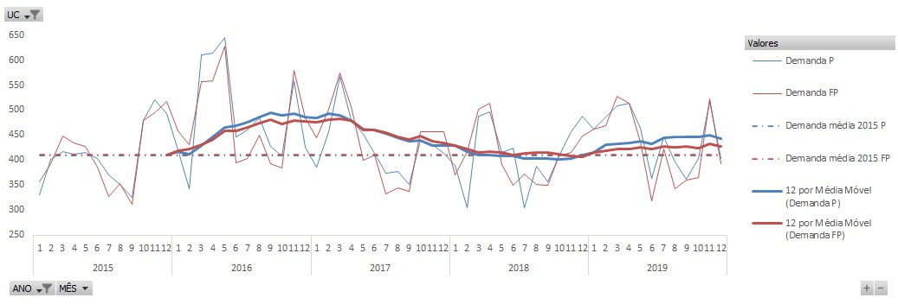
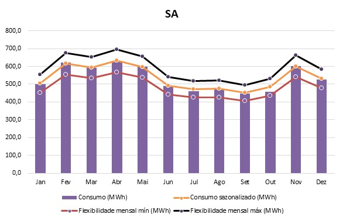
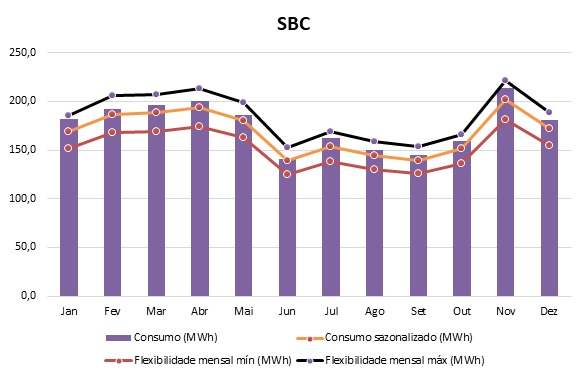
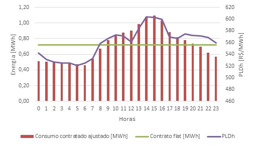
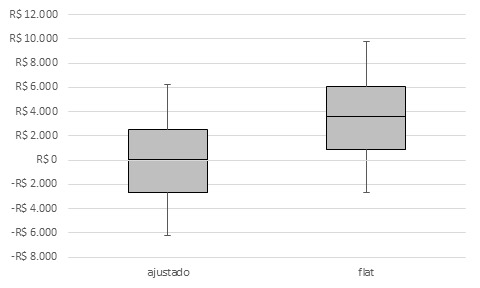

# Estudo de Viabilidade Econômica de Migração para o Mercado Livre da UFABC

## Descrição Resumida do Projeto
Este trabalho se trata de um projeto da disciplina IT304S - "Comercialização de Energia Elétrica para Grandes Clientes" ministrada na Pós-Graduação da Faculdade de Engenharia Elétrica e de Computação (FEEC) da Universidade Estadual de Campinas (UNICAMP) durante o 2º semestre de 2020 com o propósito de se avaliar a viabilidade econômica de migração para o mercado livre dos dois campi da Universidade Federal do ABC (UFABC), o campus de Santo André e o de São Bernardo do Campo.

## Equipe
* Bárbara Resende Rosado (RA 145393)
* Eliezer Emanuel Ferreira (RA 081223)
* Flora Nilce Félix de Sousa (RA 232891)
* Lucas Cesilla de Souza (RA 172639)
* Rafael Kotchetkoff Carneiro (RA 137364)

## [Vídeo do projeto](https://www.youtube.com/watch?v=pKWZxsq4D5M&ab_channel=RafaelKotchetkoffCarneiro)

## Introdução e Motivação
A Universidade Federal do ABC (UFABC) tem como propósito fornecer educação em nível superior no ABC Paulista através de seus dois campi, localizados em Santo André e São Bernardo do Campo, ambos sob área de concessão de distribuição de energia da ENEL SP. Ambas unidades consumidoras pertencem ao subgrupo A4, sendo o campus de Santo André o maior. O campus de São Bernardo do Campo está em expansão física e em número de alunos, apontando, desta forma, uma perspectiva crescente de consumo de energia. Além disso, anualmente o campus de Santo André gasta cerca de R$ 3 milhões com energia elétrica, enquanto o campus de Santo André gasta em torno de R$ 1 milhão. Estes altos gastos com energia elétrica no mercado cativo de energia elétrica, isto é, no Ambiente de Contratação Regulada (ACR), abrem margem para a análise e verificação de possíveis economias com a sua mudança para o mercado livre de energia, visto que a adesão ao mercado livre traz como principal benefício a redução de custos.

No Ambiente de Contratação Livre (ACL) os participantes podem negociar livremente todas as condições comerciais de energia elétrica como fornecedor, preço, quantidade de energia contratada, período de suprimento, pagamento, entre outras. Desta forma, os consumidores livres podem adquirir energia alternativamente ao suprimento da concessionária local, diferente do ACR, no qual cada unidade consumidora (UC) paga apenas uma fatura de energia por mês, incluindo o serviço de distribuição e a geração da energia, e as tarifas são reguladas pela ANEEL. No ACL, cada UC paga uma fatura referente ao serviço de distribuição para a concessionária local (tarifa regulada) e uma ou mais faturas referentes à compra da energia (preço negociado de contrato).

Além da isenção das bandeiras tarifárias, o mercado livre possui duas formas de energia distintas: a energia incentivada e a energia convencional, sendo a primeira estabelecida para estimular a expansão de geradores de fontes renováveis, como Pequenas Centrais Hidroelétricas (PCH), Biomassa, Eólica e Solar, e a segunda proveniente dos outros tipos de geradores, como usinas térmicas a gás ou grandes hidroelétricas. A energia incentivada permite que o comprador desse tipo de energia recebe descontos (de 50%, 80% ou 100%) na Tarifa de Uso do Sistema de Distribuição (TUSD). Desta forma, há diversas possibilidades de contratação no ACL, as quais permitem que o consumidor ajuste seu contrato de acordo com suas necessidades.

### Perguntas de Pesquisa
O mercado livre possui um potencial de economia, sendo um meio seguro e confiável de adquirir energia elétrica por um valor negociável, já que permite que o consumidor escolha, entre os diversos tipos de contratos, aquele que melhor atenda às suas expectativas de custo e benefício. Diante deste contexto, este projeto visa analisar a viabilidade de migração da UFABC para o ACL através da busca por respostas das seguintes perguntas.

#### Análise Prévia
* A Demanda Contratada está adequada? Se não, qual deveria ser a contratação?
* Há excesso de reativos? É necessário fazer correção do fator de potência da instalação?
* Existe tendência de crescimento no consumo de energia? E na Demanda Registrada?
#### Estudo de Viabilidade de Migração para o Mercado Livre
* Vale a pena migrar para o Mercado Livre? Como consumidor livre ou especial?
* Qual é a economia estimada?
* Qual é o preço da energia a partir de quando compensa a migração?
* Qual a recomendação para uma contratação?

### Objetivos do Projeto
Através da análise do histórico de consumo das unidades consumidoras da UFABC, isto é, dos campi de Santo André e São Bernardo do Campo, este projeto visa verificar sua situação atual no mercado regulado e como seria sua situação futura migrando para o mercado livre. A análise atual no ambiente cativo é realizada através da verificação de sua demanda contratada, sua modalidade de tarifação (i.e., tarifa horosazonal azul ou verde) e de seu fator de potência (através do excesso de reativos). A análise de viabilidade de migração para o mercado livre, por sua vez, é realizada através da análise de modulação, sazonalização e flexibilização do contrato, bem como simulações comparativas para aferição de custos no mercado regulado e no mercado livre.

## Recursos e Métodos
### Bases de Dados
Neste trabalho os dados utilizados foram originados da digitalização das [faturas de energia elétrica das unidades consumidoras da UFABC obtidas de janeiro de 2015 a abril de 2020.](data/raw/)

### Ferramentas
As ferramentas empregadas são listadas a seguir:
* Planilhas do excel desenvolvidas para análise da [situação atual das unidades consumidoras no mercado regulado](data/processed) e [viabilidade de migração para o mercado livre](docs/analysis);
* Simulações de [Monte Carlo](https://app.uff.br/riuff/bitstream/1/4180/1/RenatoRicardoDePaula%202014-2.PDF) para análise de sazonalição na contratação de energia no mercado livre;
* Modelo de otimização para definição da [melhor demanda a ser contratada por cada uma das unidades consumidoras](https://digital-library.theiet.org/content/journals/10.1049/iet-gtd.2019.1343)

## Metodologia
A metodologia empregada neste projeto envolveu verificar a tendência de consumo de demanda e de energia elétrica através dos dados extraídos das faturas de energia elétrica para o período de janeiro de 2015 a abril de 2020, identificando a sazonalidade de consumo das UCs de acordo com o funcionamento da universidade. Para a análise de contratação de demanda, utilizou-se um modelo de otimização linear inteiro-misto que, através de dados históricos de consumo, garante uma boa contratação para ambos os postos horários analisados. Para as análises de modulação, sazonalização e flexibilização do contrato no ACL, foi utilizado o método de Monte Carlo através da geração de um alto número de cenários a serem simulados a fim de identificar quais as melhores características a serem empregadas na contratação de energia no ACL. Finalmente, para a aferição da economia estimada que a migração para o mercado livre pode trazer empregou-se uma simulação simples utilizando dados de consumo médio de cada uma das UCs e tarifas em vigor para a concessionária de distribuição local (para o ACR), bem como valores baseados na curva *Forward* (para o ACL).

### Detalhamento e Evolução do Projeto
O projeto foi executado em duas etapas:
* A primeira parte, relatada no documento [UFABC - Relatório Análise Dados e Contrato Atual.pdf](docs/reports) visa responder as perguntas citadas em **Análise Prévia**, isto é, analisar o comportamento do consumo de energia elétrica e de demanda atual no ACR ao longo dos anos, além da verificação do fator de potência de cada uma das unidades e da definição de valores de contratação de demanda de energia elétrica.

* A segunda parte, detalhada no documento [UFABC - Relatório Recomendações Migração ACL.pdf](docs/reports) visa responder as perguntas citadas em **Estudo de Viabilidade de Migração para o Mercado Livre**. Desta forma, verifica-se todos os fatores referentes a contratação de energia elétrica no ACL, bem como compara-se os ganhos de sua possível contratação em comparação com a situação atual no ACR.

## Resultados e Discussão
Os resultados e discussões em detalhes estão apresentados nos [dois documentos descritos.](docs/reports) Desta forma, os resultados e discussões apresentados aqui tratam de forma sucinta o problema estudado.

Através das faturas de energia elétrica no período de 2015 a 2020 de ambos os campi verificou-se o histórico de demanda. A primeira característica notória de ambos os campi é a sazonalidade, que reflete bem o comportamento escolar das UCs, indicando um aumento de carga durante o período letivo, com picos em torno de março e outubro, e uma diminuição durante o período de férias, com vales por volta de setembro.
Há um comportamento de queda de demanda de maio a setembro referente a: i) período de menores temperaturas e, portanto, com menor intensidade de uso de sistemas de ar condicionado, e ii) calendário letivo quadrimestral, com período de férias em setembro, retornando às aulas somente em outubro até o período de natal, com retorno em meados de fevereiro.
De modo geral, a demanda registrada atinge os maiores valores no início e no fim de cada ano, correspondendo à estação do verão. Desse modo, a contratação de demanda é feita considerando estes meses de maior consumo. Ainda assim, nota-se que há meses em que a demanda registrada excede 105% da demanda contratada, o que implica multas para a UC, conforme estabelecido pela Resolução Normativa 414 da ANEEL.

Anualmente, os consumidores do grupo A que possuem tarifa binômia, isto é, que pagam uma parcela referente ao consumo de energia, em kWh, e outra parcela referente a demanda máxima verificada mensalmente, em kW, devem firmar o Contrato de Uso do Sistema de Distribuição (CUSD) com a concessionária de distribuição local informando o(s) valor(es) de Montante de Uso do Sistema de Distribuição (MUSD) a ser(em) contratado(s) no próximo ano. Dependendo da modalidade tarifária empregada no consumidor, este deve informar valores de MUSD para os postos horários de ponta e fora ponta – modalidade horosazonal azul – ou somente um valor de MUSD que engloba ambos os postos horários – modalidade horosazonal verde.

A UC de Santo André demonstrou possuir um comportamento bastante semelhante ao longo dos anos para ambos os postos horários. Embora em alguns meses ocorra ultrapassagem de 105% da demanda contratada, seu consumo de demanda oscila em torno do valor contratado, indicando que o contrato pode estar bem ajustado. Já a UC de São Bernardo do Campo, embora também possua um comportamento similar ao longo dos anos, verificou-se um consumo de demanda atípico para os anos de 2015 e 2016.

Adicionalmente, as curvas de demanda a seguir, Figura 1 e 2, demonstram que há uma maior diferença da demanda de ponta e fora ponta na unidade de Santo André e uma menor diferença na de São Bernardo do Campo. O comportamento relaciona-se ao fato de que o campus de Santo André possui maior quantidade de prédios administrativos e de laboratórios, com mais atividades sendo realizadas em horário comercial, abrangendo a maior parte da demanda fora ponta. O campus de São Bernardo do Campo, por sua vez, possui apenas um bloco em funcionamento, o bloco Alfa, que é dedicado principalmente ao ensino. Como 55% das aulas são realizadas no período noturno, que abrange boa parte do período de ponta, é natural que as demandas apresentem um perfil mais igualitário. No entanto, entende-se que a diferença entre demanda ponta e fora ponta para São Bernardo do Campo aumente com a expansão do campus e com o aumento das atividades administrativas e laboratoriais ao longo dos horários comerciais.

**Figura 1: Demanda verificada no campus de Santo André em kW.**

**Figura 2: Demanda verificada no campus de São Bernardo do Campo em kW.**

A análise da demanda a ser contratada, através da simulação do modelo de otimização, indicou que ambas as contratações atuais de demanda estão bem próximas aos resultados obtidos, isto é, sabendo que a contratação atual do campus de Santo André é de 1400 kW, enquanto que de São Bernardo do Campo é de 500 kW.
Conforme verificado, para o campus de Santo André o estudo resultou em um valor de aproximadamente 1260 kW para o posto horário de ponta e de 1420 kW para o de fora ponta. Atualmente, sob a modalidade horosazonal verde, o mais indicado seria que a UC contratasse o maior valor dentre os dois, logo, 1420 kW, bastante próximo aos 1400 kW atualmente contratados. Já para o campus de São Bernardo do Campo, o estudo resultou em um valor de aproximadamente 465 kW para o posto horário de ponta e 445 kW para o de fora ponta. Novamente, para uma única contratação, o valor mais indicado seria de 465 kW, um pouco inferior, porém ainda próximo, ao contrato atual de 500 kW.
Este resultado diferenciado por posto horário de ponta e fora ponta, em especial na unidade de Santo André, permite a análise da modalidade tarifária atualmente empregada. 

Para tal análise, calculou-se o gasto com a tarifa TUSD para demanda e energia para cada mês de 2019 em duas situações diferentes em cada um dos campus:
i)	Tarifa verde: utilizando a contratação sugerida sem diferenciação de posto horário, isto é, de 1420 kW para o campus de Santo André e 465 kW para o posto de São Bernardo do Campo.
ii)	Tarifa azul: utilizando a contratação sugerida com diferenciação de posto horário, isto é, de 1260 kW para o posto horário de ponta e 1420 kW para o posto horário de fora ponta o campus de Santo André e 465 kW para o posto de ponta e 445 kW para o posto horário de fora ponta para o campus de São Bernardo do Campo.

Para o campus de São Bernardo do Campo houve uma diferença bastante notória, sendo que a tarifa horosazonal verde trouxe mais vantagens e um custo verificado anualmente ainda mais barato, simbolizando que esta tarifa está bastante adequada para esta UC. Já para o campus de Santo André, notou-se que, embora se trate de uma diferença menor que a observada para São Bernardo do Campo, a tarifa horosazonal azul melhor representa esta UC, visto que seu consumo de energia é bastante alto durante o posto horário de fora ponta, o que afeta a parcela da TUSD referente a energia. 

De modo geral, a UFABC é uma universidade em crescimento, mas que enfrenta desafios de ordem econômica para continuidade das obras necessárias para sua expansão. Dado a recente crise de saúde pública e os desafios de investimentos públicos para os próximos anos, a análise considerou que a migração para o mercado livre deva ocorrer, em primeiro momento, buscando um contrato de curto prazo, possibilitando que a universidade possa corrigir sua demanda de energia conforme a situação dos próximos anos se normalize e haja uma melhor previsibilidade de expansão da universidade.
Desse modo, esta análise considerou a migração para o ACL a partir de 2022, ano em que é previsto uma melhor normalização das atividades universitárias como um todo. Considerou-se que a demanda de energia da universidade siga a média observada em 2018 e 2019, para ambas as UCs, tendo em vista que não há previsão de conclusão destas obras. Recomenda-se que o valor do consumo seja atualizado caso haja maiores certezas destes cronogramas de expansão.

Tomando como base os dados de consumo médio de energia, obtidos através da análise dos valores verificados nos anos de 2018 e 2019 de ambos os campi de Santo André (SA) e de São Bernardo do Campo (SBC), estima-se um consumo similar para curto prazo, isto é, para 2022 e 2023. Para as análises, o montante do contrato refere-se ao consumo total de cada unidade por ano e o consumo mensal foi calculado dividindo-se o montante contratado por 12 meses e a potência média (“mega médio”) dividindo-se o montante do contrato pelas horas do ano (8760 h). Para a sazonalização, recomenda-se um intervalo de 10% de tolerância para ambas as unidades, possibilitando adequar o consumo contratado mensal ao consumo observado nas unidades. O mesmo valor pode ser adotado para flexibilidade.

Nos estudos, verificou-se que a sazonalização possibilitou um melhor ajuste da energia contratada em relação ao consumo mensal, respeitando o limite de ±10% permitidos para cálculo da sazonalização, conforme pode ser visto nas Figuras 3 e 4 para ambos os campi. Percebe-se também, que o consumo total sazonalizado apresenta o mesmo valor do montante contratado, conforme requerido pela CCEE.

**Figura 3: Consumo sazonalizado e faixas de flexibilidade para o campus de Santo André.**

**Figura 4: Consumo sazonalizado e faixas de flexibilidade para o campus de São Bernardo do Campo.**

Ressalta-se que quanto maior a flexibilidade mensal adotada, mais dentro das previsões fica seu consumo. Porém, há um *trade-off* entre flexibilização e preço, uma vez que uma energia contratada com larga flexibilização possui um preço bem mais alto do que uma energia contratada com baixa flexibilização, mas com boa previsão de consumo.

Para a análise da modulação, duas alternativas foram consideradas, conforme ilustrado na Figura 5. A primeira através do ajuste da contratação horosazonal da energia em relação ao padrão de consumo das UCs. A outra através da contratação “flat”, dividindo-se o consumo diário pelas 24 horas do dia. 
O consumo horário foi modelado considerando um padrão de consumo com pico de energia no fim da tarde. Os valores de energia foram calculados através do consumo de dezembro de 2019, convertendo o consumo mensal para o consumo diário. A partir de ambas as opções, foram simulados diferentes consumos reais para unidade, permitindo uma variação de ±10% em relação ao consumo contratado ajustado para cada hora do dia. Para esta simulação foi utilizada a análise de Monte Carlo com 5.000 cenários, variando-se aleatoriamente as diferenças percentuais do consumo de energia real em relação ao consumo contratado ajustado. Para cálculo da liquidação das diferenças, utilizou-se os valores horários do PLD do dia 02/12/2020, que apresentou um dos maiores valores de energia no ano. O valor do montante consumido (MC) a ser pago ou abatido ao final do dia é dado pela diferença do consumo real e do contratado para cada hora do dia é multiplicado pelo valor do PLD horário.

**Figura 5: Modulação a partir da opção *flat* e da opção de consumo ajustado para a unidade de Santo André.**

Conforme demonstrado pelos diagramas de caixa (i.e., *boxplot*) da Figura 6, os resultados mostraram que a modulação ajustada apresentou uma menor mediana, próxima de zero, e valores de montante diário variando em torno de ± R$ 2.000,00. Já para modulação flat a mediana ficou em torno de R$ 2.500,00. Desse modo, a modulação ajustada apresentou vantagens econômicas frente a modulação flat, as quais podem ser mitigadas ou até mesmo creditadas ao consumidor caso haja uma boa gestão da energia hora a hora.

**Figura 6: Comparação do montante a ser pago ou creditado do consumidor para ambas as opções de modulação variando-se o consumo real em ±𝟏𝟎% da demanda estimada.**

Conforme exposto, recomenda-se que a universidade busque contratos de curto-prazo, tendo em vista as incertezas existentes em relação ao aumento do consumo de energia e da conclusão das obras em ambas as unidades. Desse modo, para uma análise conservadora, o montante do contrato foi baseado no consumo médio observados nos anos de 2018 e 2019 para ambas as UCs. Para questões de garantia contratuais, recomenda-se que a garantia seja de contra pagamento, devido à característica de curto prazo do contrato almejado. Desse modo, a energia do mês subsequente só é registrada pelo vendedor após o pagamento do consumo do mês anterior pelo consumidor. Recomenda-se, portanto, que a universidade possua caixa para honrar mês a mês o seu compromisso.

Após discriminadas todas as cobranças das faturas do período, simulou-se o quanto cada uma das UCs pagaria, com similaridade de condições do mercado regulado, no Mercado Livre. Para essa comparação foram utilizados os dados  da segunda semana de janeiro de 2021da plataforma *Forward*, a qual processa e disponibiliza preços de referências diárias para servirem de embasamento às estratégias de compra e venda de energia para geradores, comercializadores e grandes consumidores. Cada apuração considera as fontes convencional e incentivada 50% para um horizonte de até 5 anos que refletem os principais produtos do mercado. 

Assim, foram simulados quatro cenários para cada campus:
1) Tarifa horosazonal azul contratando energia incentivada 50%;
2) Tarifa horosazonal azul contratando energia convencional;
3) Tarifa horosazonal verde contratando energia incentivada 50%;
4) Tarifa horosazonal verde contratando energia convencional.
Em cada simulação considerou-se os valores de energia (R$/MWh) da Plataforma *Forward* para contratos trimestral e de longo prazo. Além disso, também considerou-se na simulação as despesas iniciais para cada unidade do Sistema de Medição e Faturamento (SMF), de adesão e de cobranças mensais associativas à CCEE e custo mensais de gestão. Outro acréscimo considerado foi um aumento anual de 5% nas tarifas do mercado regulado.

De acordo com as simulações, a energia incentivada se mostrou a melhor opção para os casos, com exceção para São Bernardo do Campo caso haja migração para tarifação horosazonal verde. O contrato de um a dois anos se demonstra vantajoso para as duas unidades considerando o preço atual. Finalmente, esse estudo demonstrou que há grande vantagem financeira associada a migração para o ACL e que a escolha mais vantajosa será realizada após boas negociações e diversas simulações de diferentes casos.

## Conclusões
De acordo com os [estudos realizados](data/reports) no contexto do Ambiente de Contratação Regulado (ACR) após a análise detalhada das faturas de energia das duas unidades consumidoras da UFABC, verificou-se que:
*	Ambas UCs contam com alto fator de potência, sem necessidade de compensação.
*	Há uma tendência de crescimento no consumo de ambas UCs devido ao aumento do número de alunos.
*	As demandas contratadas estão bem ajustadas, mas poderiam melhorar marginalmente.
*	A UC de Santo André pode se beneficiar de uma migração da tarifa horosazonal verde para a azul, já que sua demanda no posto horário de ponta e de fora ponta são razoavelmente distintas e seu consumo de energia no posto horário de fora ponta é bastante elevado.
*	A maior possibilidade de ganho financeiro na otimização das faturas de energia, porém, vem da migração do mercado cativo da ENEL para o Mercado Livre de Energia.

De acordo com os [estudos realizados](data/reports) no contexto de migração para o Ambiente de Contratação Livre (ACL), verificou-se que:
* Recomenda-se que a UFABC busque contratos de curto-prazo, tendo em vista as incertezas existentes em relação ao aumento do consumo de energia e da conclusão das obras em ambas as unidades.
* Para questões de garantia contratuais, recomenda-se que a garantia seja de contra pagamento, desta forma a energia do mês subsequente só é registrada pelo vendedor após o pagamento do consumo do mês anterior pelo consumidor.
* Pelos estudos de Monte Carlo, nota-se que a modulação do tipo flat não é vantajosa, sendo mais vantajoso a adequação da energia contratada em relação ao consumo horário das unidades.
* A migração para o ACL traz benefícios financeiros, exceto o contrato trimestral. De acordo com as simulações realizadas, o ideal seria na modalidade de consumidor especial através de um contrato de 2 anos. 
* Para o campus de Santo André a melhor opção é através de energia incentivada na tarifa horosazonal verde, a qual acarreta uma economia de aproximadamente R$ 1,6 milhões no período do contrato (2 anos).
* Para o campus de Santo André a melhor opção é através de. Energia incentivada na tarifa horosazonal azul, a qual acarreta uma economia de aproximadamente mais de R$ 600 mil no período de contrato (2 anos).

A migração para o mercado livre estima uma redução de R$ 1,1 milhão por ano para as duas UCs juntas da fatura de energia. Esta redução equivale a mais de 25% em relação ao gasto anual da UFABCC com eletricidade, que anualmente consome cerca de R$ 3 milhões do orçamento na UC de Santo André e R$ 1 milhão do orçamento na UC São Bernardo do Campo. Esta economia abre espaço para investimentos na continuidade da expansão da universidade e retomada de obras. Além disso, a migração para o ACL pode viabilizar diversos projetos futuros da Universidade, provendo ganhos a longo prazo. 

## Referências Bibliográficas
* [UFABC em números](http://propladi.ufabc.edu.br/images/ufabc_numeros/ufabc_numeros_ref2019.pdf)
*	[ANEEL, “Resolução Normativa nº 414, de 09 de setembro de 2010”](http://www2.aneel.gov.br/cedoc/ren2010414.pdf)
*	[ENEL Distribuição SP, “Tarifas de Energia Elétrica”](https://www.eneldistribuicaosp.com.br/corporativo-poder-publico/tarifa-de-energia-eletrica)
* [INMET, “Banco de Dados Meteorológicos do Instituto Nacional de Metereologia (INMEP)”](https://bdmep.inmet.gov.br/#)
* [UFABC, “Relatório Anual de Gestão – UFABC”](http://propladi.ufabc.edu.br/informacoes/relatorio-de-gestao)
*	[UFABC, “Histórico - Universidade Federal do ABC campus Santo André”](https://www.ufabc.edu.br/administracao/obras/santo-andre/historico)
*	[UFABC, “Histórico - Universidade Federal do ABC campus São Bernardo do Campo”](https://www.ufabc.edu.br/administracao/obras/sao-bernardo-do-campo/historico-2)
*	[B. Rosado, R. Torquato, B. Venkatesh, H. B. Gooi, W. Freitas e M. J. Rider, “Framework for optimizing the demand contracted by large customers,” IET Generation, Transmission & Distribution, 14 (4), pp. 635-644, 2019.](https://digital-library.theiet.org/content/journals/10.1049/iet-gtd.2019.1343)
*	[ANEEL, “Procedimentos de Distribuição de Energia Elétrica (PRODIST): Módulo 8 – Qualidade da Energia Elétrica”](https://www.aneel.gov.br/modulo-8)
*	[Denergia, “Dashboard: Boletim da curva Forward”](https://www.denergia.com.br/dashboard)
